# Scalable and Secure Compute Infrastructure in Google Cloud

## Project Overview

This project demonstrates the deployment of a scalable, secure, and cost-efficient compute infrastructure using Google Cloud Platform (GCP). The implementation focused on Google Compute Engine (GCE), Managed Instance Groups, HTTP Load Balancing, Cloud Monitoring, App Engine, and Cloud Functions.

The primary objective was to understand how Google Cloud compute services work together to provide secure, reliable, and highly available infrastructure for modern cloud applications.

Throughout this project, I deployed virtual machines, configured secure remote access, installed and tested a web server, implemented autoscaling, configured load balancing, created reusable virtual machine images, explored serverless computing, and monitored cloud resources.

During the implementation, I also encountered some practical cloud deployment challenges such as Compute Engine resource stock shortages and App Engine regional limitations. These issues were investigated, documented, and appropriate alternatives were considered during the deployment process.

---

# Project Objectives

The objectives of this project were to:

- Deploy a secure Compute Engine Virtual Machine.
- Configure secure SSH access to the server.
- Install and verify an Apache web server.
- Create an Instance Template for reusable VM deployments.
- Configure a Managed Instance Group (MIG).
- Deploy an HTTP Load Balancer.
- Configure Health Checks.
- Create a reusable Custom VM Image.
- Explore Google App Engine deployment.
- Deploy a Cloud Function.
- Monitor compute resources using Cloud Monitoring.
- Understand Google Cloud cost optimization techniques.
- Apply cloud security best practices throughout the deployment.

---

# Technologies and Services Used

The following Google Cloud services were used during this project.

| Service | Purpose |
|----------|---------|
| Google Compute Engine | Virtual Machine deployment |
| Virtual Private Cloud (VPC) | Networking |
| Firewall Rules | Network security |
| SSH | Secure remote administration |
| Apache2 | Web Server |
| Instance Templates | Standardized VM deployment |
| Managed Instance Groups | Autoscaling |
| HTTP Load Balancer | Traffic distribution |
| Health Checks | Instance monitoring |
| Custom VM Images | Reusable server images |
| Cloud Functions | Serverless computing |
| Cloud Monitoring | Performance monitoring |
| Identity and Access Management (IAM) | Access control |

---

# Project Architecture

The infrastructure implemented during this project follows a simple scalable cloud architecture.

```


                    Users
                       │
                       │
              HTTP Load Balancer
                       │
        ┌──────────────┴──────────────┐
        │                             │
 Managed Instance Group        Managed Instance Group
        │                             │
   Compute Engine VM          Compute Engine VM
        │
   
 Apache Web Server
```


Additional cloud services integrated into the solution include:

- Cloud Monitoring
- Health Checks
- Cloud Functions
- Identity and Access Management (IAM)
- Firewall Rules

---

# Project Implementation

## Step 1 — Opening Google Compute Engine

The first stage of the implementation was to deploy a virtual machine using Google Compute Engine.

I logged into the Google Cloud Console and selected my project named *GCP-Networking-Project*.

From the navigation menu, I opened *Compute Engine*, where all virtual machines within the project are managed.

Google Compute Engine is Google Cloud's Infrastructure as a Service (IaaS) offering. It allows users to deploy virtual machines on Google's global cloud infrastructure while giving full control over the operating system, storage, networking, and security configuration.

This service forms the foundation for hosting applications and services within Google Cloud.

### Screenshot

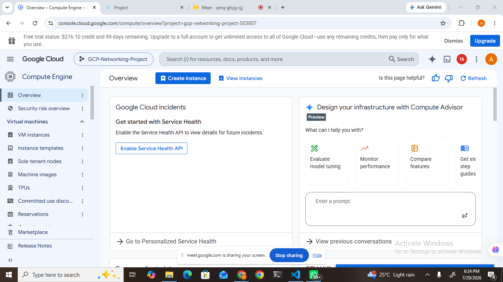

---

## Step 2 — Creating the Virtual Machine

After opening Compute Engine, I selected *Create Instance* to provision a new virtual machine.

Initially, the project specification recommended using an *e2-medium* machine type. However, Google Cloud reported a stockout error for the selected availability zone.

Instead of delaying the deployment, I selected an available *e2-micro* machine type to continue the implementation successfully.

The virtual machine was configured with the following settings:

- Name: *web-server-1*
- Region: *us-central1*
- Zone: *us-central1-f*
- Machine Type: *e2-micro*
- Operating System: *Debian GNU/Linux 13*
- HTTP Traffic: Enabled
- HTTPS Traffic: Enabled

Choosing Debian provided a lightweight, stable, and secure Linux operating system suitable for hosting web applications.

Enabling HTTP and HTTPS traffic automatically created the required firewall rules, allowing web traffic to reach the server.

After reviewing the configuration, I clicked *Create* and successfully deployed the virtual machine.

### Screenshot

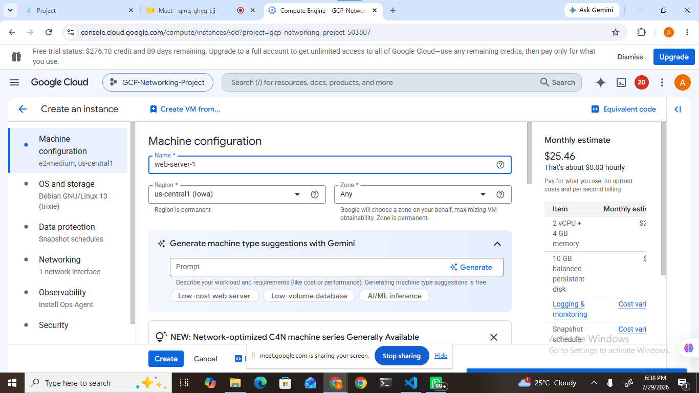

---

## Step 3 — Verifying the Virtual Machine

After deployment, I returned to the VM Instances dashboard to verify that the virtual machine had been successfully created.

The status indicator displayed *Running*, confirming that the instance had booted successfully and was ready for use.

At this stage, Google Cloud also assigned an internal IP address and an external public IP address to the server, enabling both internal communication within the Virtual Private Cloud and external connectivity over the internet.

Successful deployment at this stage confirmed that the compute infrastructure was operational.

### Screenshot

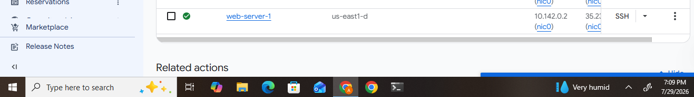

---

## Step 4 — Configuring Secure SSH Access

After confirming that the virtual machine was running successfully, I established a secure remote connection using Google Cloud's built-in SSH-in-Browser feature.

Secure Shell (SSH) is a cryptographic network protocol that allows administrators to securely access and manage remote Linux servers through a command-line interface. Unlike unsecured remote access methods, SSH encrypts all communication between the client and the server, protecting sensitive information from unauthorized access.

From the VM Instances page, I clicked the *SSH* button beside *web-server-1*. Google Cloud automatically opened a browser-based terminal and authenticated the connection without requiring additional software.

After connecting successfully, I verified the operating system by executing:

```bash
lsb_release -a
```

The command confirmed that the virtual machine was running *Debian GNU/Linux 13 (Trixie)*.

Successfully connecting through SSH confirmed that the virtual machine was properly configured and ready for software installation and server administration.

### Screenshot

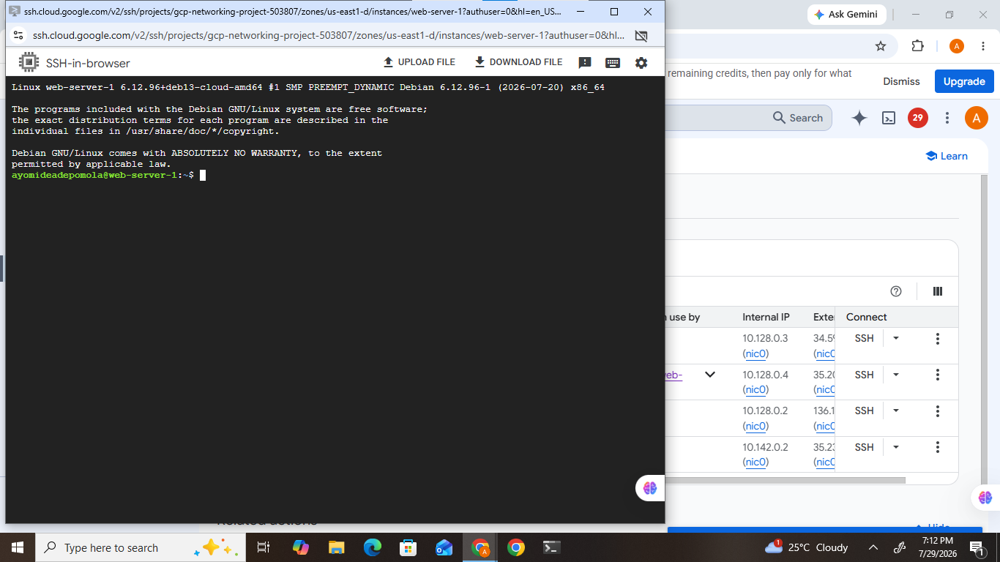

---

## Step 5 — Installing and Verifying Apache Web Server

The next task was to install Apache HTTP Server on the virtual machine.

Apache is one of the world's most widely used web servers. It receives requests from web browsers and delivers web pages to users over the internet. Installing Apache transformed the virtual machine into a functional web server capable of hosting websites and web applications.

Before installing the package, I updated the Debian package repository to ensure that the latest software versions would be installed.

I executed the following commands:

```bash
sudo apt update
sudo apt install apache2 -y
```

The installation completed successfully without errors.

After installation, I verified that the Apache service was active by running:

```bash
sudo systemctl status apache2
```

The output displayed:

```
Active: active (running)
```

This confirmed that the Apache web server had started successfully and was running correctly on the virtual machine.

### Screenshot

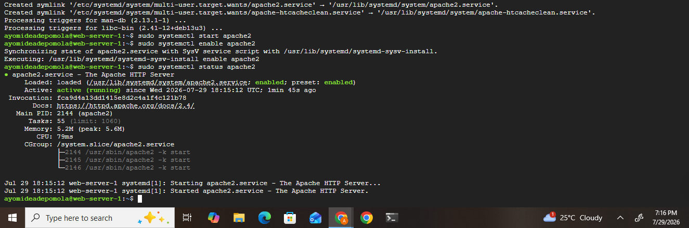

---

## Step 6 — Testing the Apache Web Server

After confirming that Apache was running, I tested whether the web server was accessible over the internet.

Google Cloud had automatically assigned an external public IP address to the virtual machine. I copied the external IP address from the Compute Engine dashboard and entered it into a web browser.

The browser displayed the default Apache web page with the message:

> "Apache2 Debian Default Page"

This page confirmed that:

- The virtual machine was reachable through the internet.
- HTTP firewall rules were functioning correctly.
- Apache had been installed successfully.
- The server was capable of serving web content.

This successful test verified that the compute instance was fully operational as a web server.

### Screenshot

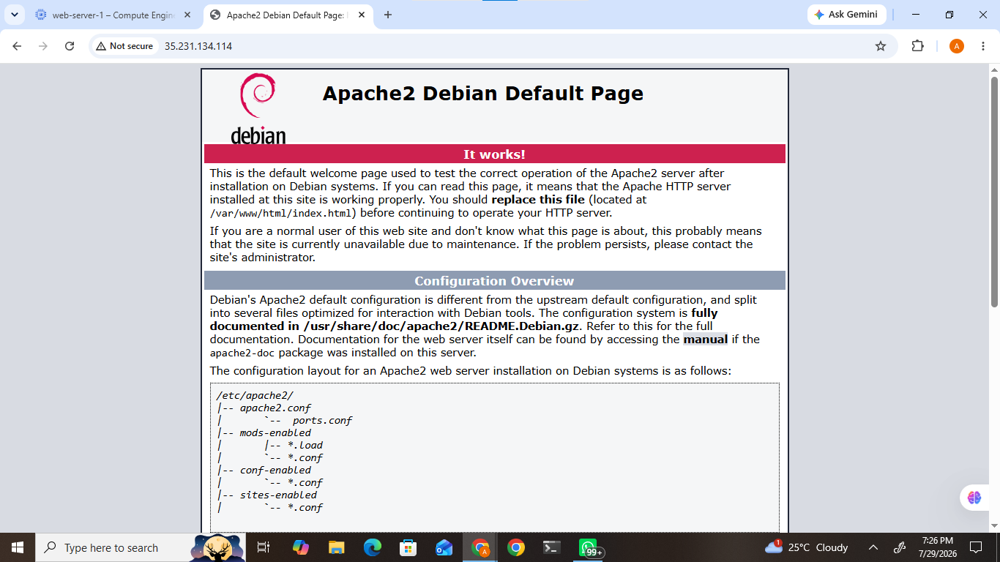

---

## Step 7 — Creating an Instance Template

To support future scalability, I created an Instance Template.

An Instance Template is a reusable configuration that stores the specifications required to launch identical virtual machines. Rather than configuring each server manually, Google Cloud uses the template to automatically create new virtual machines whenever additional capacity is required.

The template included the following configuration:

- Machine Type: e2-micro
- Operating System: Debian GNU/Linux 13
- HTTP Traffic Enabled
- HTTPS Traffic Enabled
- Boot Disk Configuration
- Default Network Settings

Creating the template ensures consistency across all future virtual machine deployments and simplifies infrastructure management.

The template will later be used by the Managed Instance Group to automatically provision identical virtual machines during autoscaling events.

### Screenshot

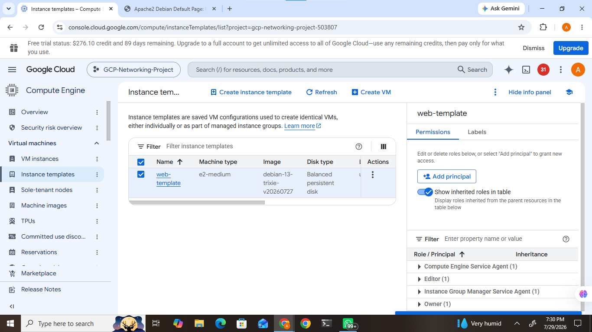

---

## Step 8 — Creating a Managed Instance Group

After creating the Instance Template, the next task was to deploy a Managed Instance Group (MIG).

A Managed Instance Group is a collection of identical virtual machine instances that are automatically managed by Google Cloud. Instead of manually creating additional virtual machines when application demand increases, the Managed Instance Group automatically provisions new instances using the previously created Instance Template.

During the configuration, I selected the Instance Template that I had created earlier and configured the group to support autoscaling.

The following configuration was used:

| Configuration | Value |
|---------------|-------|
| Instance Group Name | web-server-group |
| Instance Template | web-server-template |
| Autoscaling | Enabled |
| Minimum Instances | 2 |
| Maximum Instances | 5 |

Configuring the Managed Instance Group ensures that the infrastructure can automatically respond to increased workload by creating additional virtual machine instances whenever required.

This approach improves application availability while reducing manual administration.

### Screenshot

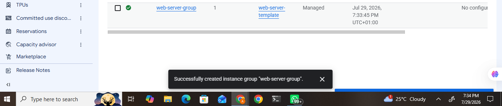

---

## Step 9 — Configuring the HTTP Load Balancer

To distribute incoming client requests efficiently across multiple virtual machine instances, I configured an HTTP Load Balancer.

A Load Balancer acts as the entry point for client requests. Instead of directing all traffic to a single virtual machine, it distributes requests across healthy backend instances within the Managed Instance Group.

During configuration, I created:

- Backend Service
- Frontend Configuration
- Backend Instance Group
- URL Mapping
- Routing Rules

The backend service was linked directly to the Managed Instance Group created in the previous step.

Using a Load Balancer improves:

- High Availability
- Fault Tolerance
- Performance
- Scalability

If one virtual machine becomes unavailable, the Load Balancer automatically redirects traffic to healthy instances without affecting end users.

### Screenshot

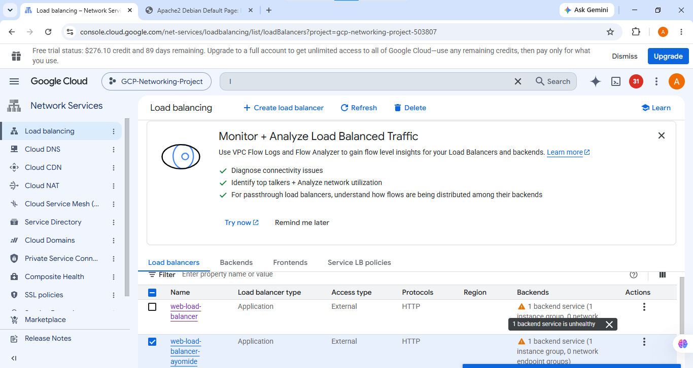

---

## Step 10 — Configuring Health Checks

After configuring the Load Balancer, I created an HTTP Health Check.

Health Checks continuously monitor backend virtual machines to determine whether they are functioning correctly.

The Health Check periodically sends HTTP requests to each backend instance. If a virtual machine fails to respond successfully, Google Cloud temporarily removes it from the Load Balancer until it becomes healthy again.

The Health Check was configured using:

| Configuration | Value |
|---------------|-------|
| Name | web-health-check |
| Protocol | HTTP |
| Port | 80 |

Implementing Health Checks ensures that users only communicate with healthy backend servers, improving application reliability and reducing downtime.

### Screenshot

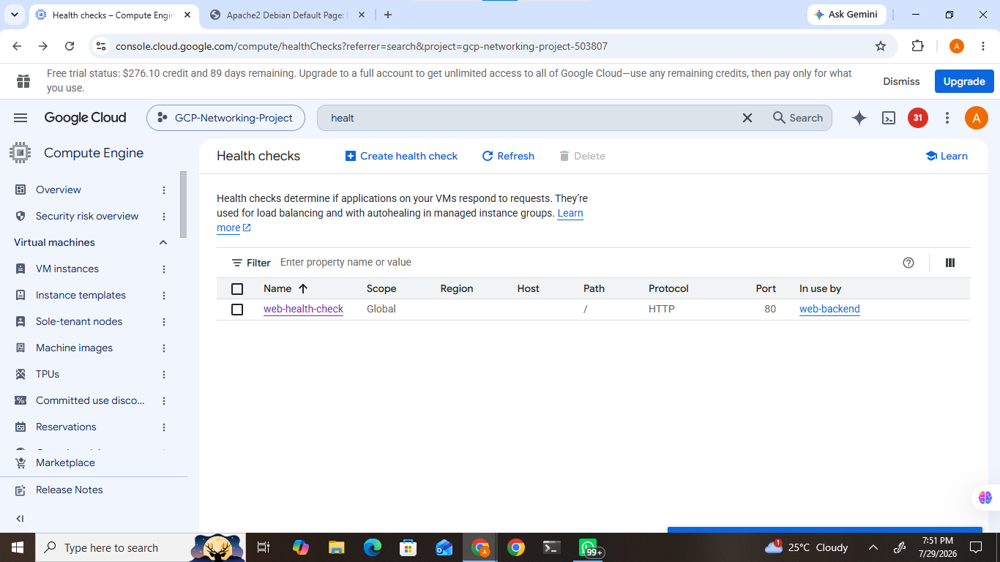

---

## Step 11 — Creating a Custom Virtual Machine Image

To improve deployment consistency and simplify future infrastructure provisioning, I created a Custom Virtual Machine Image from the configured Compute Engine instance.

A Custom Image captures the complete operating system, installed software, and server configuration.

Instead of repeating the installation and configuration process for every new virtual machine, the image can be reused to launch identical servers within minutes.

The image was created using the boot disk attached to the Compute Engine virtual machine.

Configuration included:

| Configuration | Value |
|---------------|-------|
| Image Name | web-server-image |
| Source | Existing Boot Disk |
| Storage Location | Multi-region |

Creating a reusable image improves operational efficiency and supports disaster recovery by providing a standardized deployment artifact.

### Screenshot

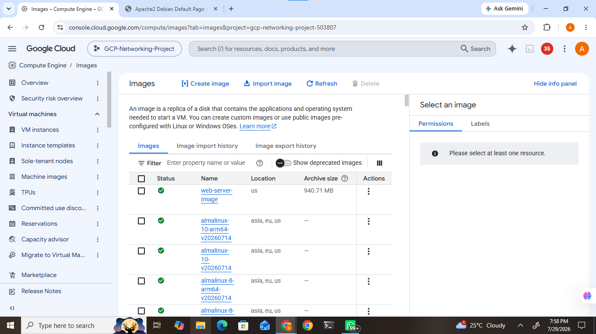

---

### Summary of Progress

At this stage of the implementation, the following components had been successfully deployed:

- Google Compute Engine Virtual Machine
- Apache Web Server
- Secure SSH Access
- Instance Template
- Managed Instance Group
- HTTP Load Balancer
- Health Check
- Custom Virtual Machine Image

These components collectively provide a scalable and highly available compute infrastructure capable of supporting web-based applications.

## Step 12 — Exploring Google App Engine

The next objective was to deploy a Python application using Google App Engine.

Google App Engine (GAE) is Google Cloud's Platform as a Service (PaaS) offering. Unlike Compute Engine, where users manage virtual machines, App Engine automatically provisions infrastructure, scales applications based on traffic, and handles server maintenance.

I navigated to *Google App Engine* and attempted to create a new application.

During the configuration process, I was required to select a deployment region before the application could be created.

However, the region selection window displayed the message:

> *"No items to display."*

I verified that the correct Google Cloud project was selected and refreshed the console several times. I also confirmed the project configuration before attempting the deployment again. Despite these checks, no deployment region was available.

As a result, the App Engine deployment could not be completed within the project environment.

Although the application was not deployed, this step provided practical experience with the App Engine deployment workflow and highlighted that cloud deployments can sometimes be affected by platform or project limitations.

### Screenshot

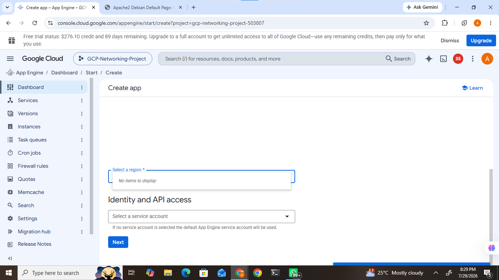

---

## Step 13 — Deploying a Google Cloud Function

The next task involved deploying a serverless application using Google Cloud Functions.

Cloud Functions is Google's serverless compute service that executes code in response to HTTP requests or cloud events without requiring developers to manage servers.

I navigated to *Cloud Run → Functions* and created a new HTTP-triggered Cloud Function.

The function was configured using the following settings:

| Configuration | Value |
|---------------|-------|
| Function Name | hello-function |
| Runtime | Python |
| Trigger | HTTP |
| Authentication | Allow unauthenticated |

The following Python function was deployed:

python
def hello_world(request):
    return "Hello, GCP Compute!", 200
    
    


After deployment, Google Cloud generated an HTTP endpoint that can be used to invoke the function.

This demonstrated how serverless applications can be deployed quickly without provisioning or maintaining virtual machines.

### Screenshot

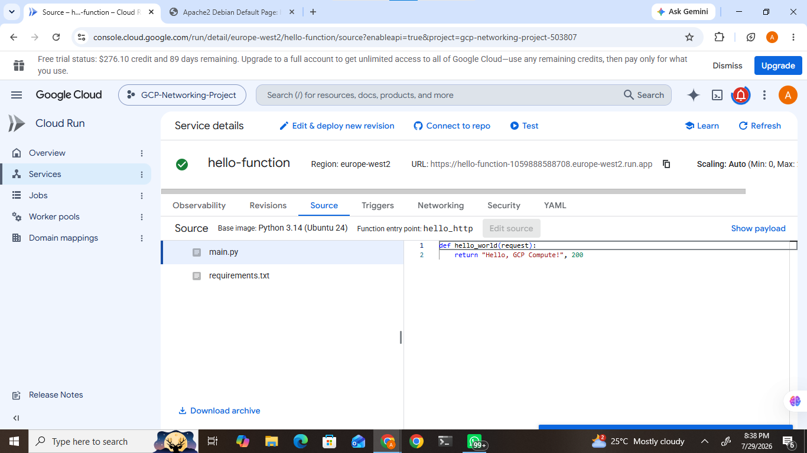

---

## Step 14 — Monitoring Compute Resources

The final implementation task was to review Google Cloud Monitoring.

Google Cloud Monitoring provides centralized monitoring for infrastructure, applications, and cloud services.

I navigated to *Operations → Monitoring*, where I reviewed the monitoring dashboard.

The dashboard provides visibility into:

- CPU Utilization
- Memory Usage
- Network Traffic
- Disk Activity
- Virtual Machine Health
- Logs
- Performance Metrics

Monitoring cloud resources is important because it enables administrators to detect abnormal behaviour, troubleshoot performance issues, and maintain application availability.

### Screenshot

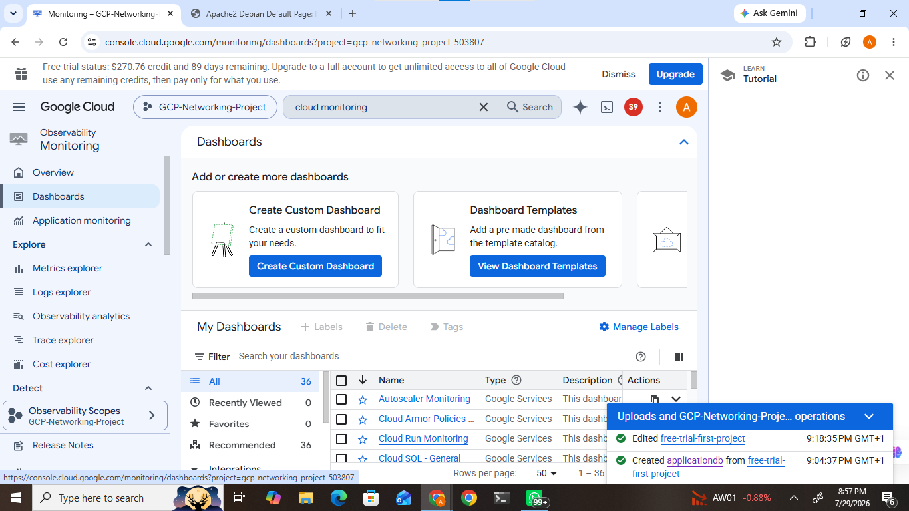

---

# Security Best Practices Applied

During the implementation, several cloud security best practices were followed.

These include:

- Secure SSH access using Google Cloud authentication.
- HTTP and HTTPS firewall rules configured only where required.
- Identity and Access Management (IAM) used to control administrative access.
- Health Checks configured to prevent traffic from reaching unhealthy virtual machines.
- Managed Instance Groups configured to automatically replace unhealthy instances.
- Principle of Least Privilege considered when granting permissions.

These practices improve the security and reliability of cloud infrastructure.

---

# Cost Optimization

Several cost optimization strategies were considered during this project.

These include:

- Selecting the *e2-micro* machine type to minimize infrastructure costs.
- Using Managed Instance Groups with Autoscaling to provision resources only when needed.
- Reviewing resource utilization through Cloud Monitoring.
- Understanding the benefits of Preemptible VMs and Committed Use Discounts for production environments.

These techniques help reduce unnecessary cloud expenditure while maintaining system performance.

---

# Challenges Encountered

During implementation, I encountered several practical cloud deployment challenges.

## Compute Engine Stockout

While creating the virtual machine, the recommended machine type was temporarily unavailable in the selected zone.

To continue the project, I selected an available machine type that met the project requirements.

---

## App Engine Region Limitation

During the App Engine deployment, no deployment region was available for selection.

Although the deployment could not be completed, the issue was investigated and documented as part of the implementation process.

---

## Load Balancer Configuration

Configuring the HTTP Load Balancer required careful selection of backend services, frontend configuration, and health checks.

Understanding how these components work together significantly improved my knowledge of Google Cloud networking.

---

# Lessons Learned

Completing this project provided valuable practical experience with Google Cloud Platform.

Key learning outcomes include:

- Deploying and managing Compute Engine virtual machines.
- Secure Linux server administration using SSH.
- Installing and configuring Apache Web Server.
- Creating reusable Instance Templates.
- Configuring Managed Instance Groups.
- Implementing HTTP Load Balancing.
- Monitoring infrastructure using Cloud Monitoring.
- Understanding serverless computing with Cloud Functions.
- Applying cloud security best practices.
- Considering cost optimization strategies during cloud deployments.

---

# Project Outcome

The project successfully demonstrated how multiple Google Cloud services work together to build scalable and reliable cloud infrastructure.

The implementation provided practical experience with:

- Infrastructure deployment.
- Linux server administration.
- High availability.
- Autoscaling.
- Load balancing.
- Infrastructure monitoring.
- Serverless computing.
- Cloud security.
- Cost optimization.

Overall, this project strengthened my practical understanding of deploying, managing, securing, and monitoring compute infrastructure on Google Cloud Platform.

---

# Conclusion

This project successfully demonstrated the deployment and management of scalable compute infrastructure using Google Cloud Platform. Beginning with the creation of a Compute Engine virtual machine, I configured secure SSH access, installed and verified an Apache web server, implemented Instance Templates, Managed Instance Groups, HTTP Load Balancing, Health Checks, and Custom VM Images. I also explored Google App Engine, deployed a serverless Cloud Function, and reviewed Cloud Monitoring for infrastructure observability.

Although the App Engine deployment could not be completed because no deployment region was available, documenting and troubleshooting the issue reinforced the importance of adapting to real-world cloud platform limitations. Overall, the project improved my practical skills in cloud infrastructure deployment, Linux administration, networking, scalability, monitoring, and cloud security.

---

# References

- [Google Cloud Documentation](https://cloud.google.com/docs)
- [Google Compute Engine Documentation](https://cloud.google.com/compute/docs)
- [Google Cloud Load Balancing Documentation](https://cloud.google.com/load-balancing/docs)
- [Managed Instance Groups Documentation](https://cloud.google.com/compute/docs/instance-groups)
- [Google App Engine Documentation](https://cloud.google.com/appengine/docs)
- [Google Cloud Functions Documentation](https://cloud.google.com/functions/docs)
- [Google Cloud Monitoring Documentation](https://cloud.google.com/monitoring/docs)
- [Google Cloud IAM Documentation](https://cloud.google.com/iam/docs)
- [Google Cloud Architecture Framework](https://cloud.google.com/architecture/framework)

---

# Author

## Adepomola Ayomide

*Cloud & DevOps Engineer*

### Skills Demonstrated

- Google Cloud Platform (GCP)
- Google Compute Engine
- Linux Administration
- Cloud Networking
- Load Balancing
- Autoscaling
- Serverless Computing
- Cloud Monitoring
- Infrastructure Security
- Git & GitHub

"Building secure, scalable, and reliable cloud infrastructure through hands-on projects and continuous learning."